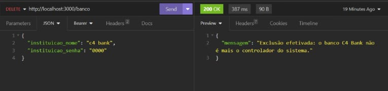

# _API - Sistema Bancário_

_Essa **RESTful API** simula algumas das principais funcionalidades de um sistema bancário back-end. Ao cadastrar um banco e ativa o sistema através do login, imediatamente são liberadas as funcionalidades relacionadas ao banco e ao cadastro de clientes para abertura de contas._

_Algumas dessas funcionalidades são geração de informações do banco, consulta indivídual ou geral de dados cadastrais e contas dos clientes, atualização e exclusão de dados do banco etc._

_Já em relação a abertura de conta, ao ser realizado o primeiro cadastro de cliente é gerado automaticamente um conta, ao qual feito login dá acesso as diversas funcionalidades, sendo algumas delas, acesso a informações de dados cadastrados, consulta a dados da conta, geração de relatórios de depositos, saques e transferências etc._

## _Funcionalidades do Projeto_

### `Banco:`

- _Cadastro do banco controlador do sistema._
- _Login banco - ativação do sistema._
- _Consulta detalhada de informações do banco._
- _Consulta de contas bancárias ativas do banco._
- _Consulta de dados cadastrais dos clientes._
- _Exclusão de conta bancário do cliente._
- _Atualização de dados cadastrais do banco._
- _Exclusão de dados cadastrais do banco._

### `Conta:`

- _Casdatro de cliente e abertura automática de conta bancária._
- _Login cliente._
- _Consulta detalhada de informações do cliente._
- _Consulta detalhada de informações da conta bancário._
- _Atualização de dados cadastrais do cliente._
- _Exclusão de dados cadastrais e conta bancária do cliente._
- _Consulta de extrato._
- _Efetuar deposito._
- _Efetuar saque._
- _Efetuar transferências._

#

#### `Rodando o projeto:`

```
# 1° Clone o projeto

git clone git@github.com:tiagosoussa7/projeto-api-sistemaBancarioDigital.git

# 2° Instale as depedências

npm init -y
npm i -D nodemon
npm i express pg knex bcrypt jsonwebtoken joi dotenv

# 3° Execute o back-end

npm run dev
```

## _Endpoints - Banco:_

<details>
<summary><b>Cadastro banco</b></summary>
<br>

#### `POST/banco`

_Essa rota é utilizada para o cadastro do banco controlador do sistema._

#### _Requisição:_

_Sem parametros de rota ou query. O corpo (body) deverá possuir um objeto com as seguintes propriedades (respeitando estes nomes)._

- _instituicao_nome_
- _instituicao_senha_

#### _Requisitos obrigatórios:_

- _Valida se os campos **instituicao_nome** e **instituicao_senha** foram passados corretamente._
- _Valida se já existe um banco controlador cadastrado no sistema._
- _Criptografa a senha antes de pesistir no banco de dados._
- _Cadastra o banco que irá controlar o sistema._

#### _Resposta:_

_Caso haja **sucesso** na requisição de cadastro, o corpo (body) da resposta haverá um objeto com uma propriedade mensagem e resposta adequada a solicitação._

// imagem

</details>

<details>
<summary><b>Login banco</b></summary>
<br>

#### `POST/banco/login`

_Essa rota permite que o banco controlador cadastrado realize login e ative o sistema e as funcionalidades do banco como também ativa a rota de cadastro de contas._

#### _Requisição:_

_Sem parametros de rota ou query. O corpo (body) deverá possuir um objeto com as seguintes propriedades (respeitando estes nomes)._

- _instituicao_nome_
- _instituicao_senha_

#### _Requisitos obrigatórios:_

- _Valida se os campos **instituicao_nome** e **instituicao_senha** foram passados corretamente._
- _Verifica se o nome e a senha da instituição conferem com a do cadastro._
- _Cria um token de autenticação para o banco._

#### _Resposta:_

_Caso haja **sucesso** na requisição de login, o corpo (body) da resposta haverá um objeto com a propriedade token, que deverá possuir como valor o token de autenticação gerado._

// imagem

</details>

##

#### **_ATENÇÃO: todas as funcionalidades (endpoints) do banco a seguir, exigirão o token de autenticação do banco controlador do sistema logado. Portanto será necessário validar o token informado_**

##

<details>
<summary><b>Informações banco</b></summary>
<br>

#### `GET/banco/informacao`

_Essa rota é utilizada para o gerar um relatório com o nome do banco cadastrado, a quantidade de contas ativas, o orçamento total do banco, ao qual é a soma do saldo de todas as contas ativas e a data e horário de ativação do sistema bancário._

#### _Requisição:_

_Sem parametros de rota ou query.O corpo (body) da requisição não deverá possuir nenhum conteúdo._

#### _Requisitos obrigatórios:_

- _O endpoint informará em forma de objeto as informações do banco._

#### _Resposta:_

_Caso haja **sucesso** na requisição, o corpo (body) da resposta haverá um objeto com as informações detalhadas do banco._

// imagem

</details>

<details>
<summary><b>Consultar contas</b></summary>
<br>

#### `GET/banco/consultar/conta`

_Essa rota permite ao banco fazer duas modalidades de consulta, uma indivídual, passando o número da conta que ele deseja consultar e a outra generalizada, ao qual todas as contas que ele possui no banco de dados serão exibidas._

#### _Requisição:_

_Sem parametros de rota. O corpo (body) não possuirá requisição em caso de consulta geral de contas, e deverá possuir requisição em caso de consulta indivídual de conta, com um objeto com a seguinte propriedade (respeitando este nome)._

- _numero_conta_

#### _Requisitos obrigatórios:_

- **_Em caso de consulta indivídual de conta_**:
- - _valida se o campo **numero_conta** foi passado corretamente._
- - _Valida se o número de conta existe no banco de dados._

#### _Resposta:_

_Caso haja **sucesso** na requisição, no corpo (body) da resposta haverá, em caso de consulta geral, um objeto com a listagem de todas as contas no banco ou, em caso de consulta indivídual, um objeto com as informações da conta consultada._

// imagem

</details>

<details>
<summary><b>Consultar clientes</b></summary>
<br>

#### `GET/banco/consultar/cliente`

_Essa rota permite ao banco fazer duas modalidades de consulta, uma indivídual, passando o CPF do cliente que ele deseja consultar e a outra generalizada, ao qual são listados todos os dados dos clientes com conta no banco._

#### _Requisição:_

_Sem parametros de rota ou query. O corpo (body) não possuirá requisição em caso de consulta geral de dados dos clientes, e deverá possuir requisição em caso de consulta indivídual de dados do cliente, com um objeto com a seguinte propriedade (respeitando este nome)._

- _cpf_

#### _Requisitos obrigatórios:_

- **_Em caso de consulta indivídual de conta_**:
- - _valida se o campo **CPF** foi passado corretamente._
- - _Valida se o CPF existe no banco de dados._

#### _Resposta:_

_Caso haja **sucesso** na requisição, no corpo (body) da resposta haverá, em caso de consulta geral, um objeto com a listagem de todas os dados dos clientes do banco ou, em caso de consulta indivídual, um objeto com as informações dos dados do cliente consultado._

//imagem

</details>

<details>
<summary><b>Atualizar dados</b></summary>
<br>

#### `PUT/banco`

_Essa rota permite ao banco modificar seus dados cadastrais._

#### _Requisição:_

_Sem parametros de rota ou query. O corpo (body) possuirá requisição dinâmica, podendo o banco modificar o nome e/ou senha.Para isso é necessário passar um objeto com a(s) seguinte(s) propriedade(s) (respeitando este(s) nome(s))._

- _instituicao_nome_
- _instituicao_senha_

#### _Requisitos obrigatórios:_

- - _Valida se o(s) campo(s) instituição nome e/ou senha foram passados corretamente._
- - _Valida se o(s) campo(s) instituição nome e/ou senha são os mesmo do banco cadastrado._

#### _Resposta:_

_Caso haja **sucesso** na requisição, no corpo (body) da resposta haverá um objeto com mensagem adequada a solicitação._

</details>

<details>
<summary><b>Excluir: conta cliente</b></summary>
<br>

#### `DELETE/banco/conta`

_Essa rota permite ao banco excluir qualquer conta bancária dos seus cliente._

#### _Requisição:_

_Sem parametros de rota ou query. O corpo (body) possuirá requisição dinâmica, podendo o banco optar pela exclusão da conta do cliente passando o seu CPF ou número de conta correspondente. Para isso é necessário passar um objeto com a seguinte propriedade (respeitando este nome)._

- _numero_conta **ou** cpf_

#### _Requisitos obrigatórios:_

- - _Validar se o campo numero_conta ou cpf foram passados corretamente._
- - _Validar se o campo numero_conta ou cpf existe no banco de dados._
- - _Validar se a conta a ser excluída possui saldo zero._

#### _Resposta:_

_Caso haja **sucesso** na requisição, no corpo (body) da resposta haverá um objeto com mensagem adequada a solicitação._

</details>

<details>
<summary><b>Excluir: cadastro do banco</b></summary>
<br>

#### `DELETE/banco`

_Essa rota permite ao banco excluir seus próprios dados cadastrais._

#### _Requisição:_

_Sem parametros de rota ou query. O corpo (body) possuirá requisição obrigatória com um objeto com as seguintes propriedades (respeitando estes nomes)._

- _instituicao_nome_
- _instituicao_senha_

#### _Requisitos obrigatórios:_

- - _Validar se os campos instituicao_nome e instituicao_senha foram passados corretamente._
- - _Validar se os campos instituicao\_ nome e senha são os mesmo do banco de dados do sistema._
- - _Validar se existem alguma conta bancária com saldo positivo._

#### _Resposta:_

_Caso haja **sucesso** na requisição, no corpo (body) da resposta haverá um objeto com mensagem adequada a solicitação._

#

###### `Imagem:`



</details>

## _Endpoints - Conta:_

<details>
<summary><b>Cadastro conta</b></summary>
<br>

#### `POST/conta`

_Essa rota permite o cadastro de clientes e a geração automática da conta bancária._

#### _Requisição:_

_Sem parametros de rota ou query. O corpo (body) deverá possuir um objeto com as seguintes propriedades (respeitando estes nomes)._

- _nome_
- _cpf_
- _email_
- _data_nascimento_
- _senha_

#### _Requisitos obrigatórios:_

- _Valida se os campos **nome**, **cpf**,**email**, **data_nascimento** e **senha** foram passados corretamente._
- _Valida se o **cpf** e **email** já estão cadastrados no banco._
- _Valida se o cliente que deseja abrir a conta tem 18 anos ou mais._
- _Criptografa a senha antes de pesistir no banco de dados._

#### _Resposta:_

_Caso haja **sucesso** na requisição de cadastro, o corpo (body) da resposta haverá um objeto com uma propriedade mensagem e resposta adequada a solicitação._

// imagem

</details>

<details>

<summary><b>Login conta</b></summary>
<br>

#### `POST/conta/login`

_Essa rota permite que o cliente cadastrado realize login e tenha acesso as funcionalidades da sua conta._

#### _Requisição:_

_Sem parametros de rota ou query. O corpo (body) deverá possuir um objeto com as seguintes propriedades (respeitando estes nomes)._

- _email **ou** cpf_
- _senha_

#### _Requisitos obrigatórios:_

- _Valida se os campos **email** ou **cpf** e **senha** foram passados corretamente._
- _Verifica se o **email** ou **cpf** e **senha** conferem com a do cadastro do cliente._
- _Cria um token de autenticação para a conta._

#### _Resposta:_

_Caso haja **sucesso** na requisição de login, o corpo (body) da resposta haverá um objeto com a propriedade token, que deverá possuir como valor o token de autenticação gerado._

// imagem

</details>

#### **_ATENÇÃO: todas as funcionalidades (endpoints) da conta a seguir, exigirão o token de autenticação da conta bancária logada no sistema. Portanto será necessário validar o token informado_**

<details>
<summary><b>Informações conta</b></summary>
<br>

#### `GET/conta/informacao`

_Essa rota é utilizada para o gerar um relatório com os dados da conta bancária do cliente, como saldo, numero de conta, data e hora de abertura de conta etc._

#### _Requisição:_

_Sem parametros de rota ou query.O corpo (body) da requisição não deverá possuir nenhum conteúdo._

#### _Requisitos obrigatórios:_

- _O endpoint informará em forma de objeto as informações da conta bancária._

#### _Resposta:_

_Caso haja **sucesso** na requisição, o corpo (body) da resposta haverá um objeto com as informações detalhadas da conta._

// imagem

</details>

<details>
<summary><b>Informações cliente</b></summary>
<br>

#### `GET/conta/informacao/cliente`

_Essa rota é utilizada para o gerar um relatório com os dados cadastrais do cliente._

#### _Requisição:_

_Sem parametros de rota ou query.O corpo (body) da requisição não deverá possuir nenhum conteúdo._

#### _Requisitos obrigatórios:_

- _O endpoint informará em forma de objeto as informações dos dados do cliente._

#### _Resposta:_

_Caso haja **sucesso** na requisição, o corpo (body) da resposta haverá um objeto com as informações detalhadas do cliente._

// imagem

</details>

<details>
<summary><b>Extrato</b></summary>
<br>

#### `GET/conta/extrato`

_Essa rota é utilizada para o gerar um relatório com os dados de extrato do cliente._

#### _Requisição:_

_Sem parametros de rota ou query. O corpo (body) deverá possuir um objeto com a seguinte propriedade (respeitando este nome)._

- _extrato_

#### _Requisitos obrigatórios:_

- _Valida se o campo **transacao** foi passado corretamente._
- _Verifica se o cliente especificou qual o tipo de **extrato** deseja consultar, se: **depositos**, **saques**, **transferencias** ou **completo**._

#### _Resposta:_

_Caso haja **sucesso** na requisição, o corpo (body) da resposta haverá um objeto com as informações detalhadas de qual tipo de extrato foi solicitado pelo cliente._

// imagem

</details>

<details>
<summary><b>Atualizar dados cadastrais</b></summary>
<br>

#### `PUT/conta`

_Essa rota permite ao cliente modificar seus dados cadastrais._

#### _Requisição:_

_Sem parametros de rota ou query. O corpo (body) possuirá requisição dinâmica, podendo o cliente modificar o **nome**, **cpf**, **email**,**data_nascimento** ou **senha**.Para isso é necessário passar um objeto com a(s) seguinte(s) propriedade(s) (respeitando este(s) nome(s))._

- _nome_
- _cpf_
- _email_
- _data_nascimento_
- _senha_

#### _Requisitos obrigatórios:_

- - _Valida qual(is) campo(s) foram passados e se estão corretos._
- - _Valida se o(s) campo(s) **cpf** e/ou **email** são os mesmo da conta bancária ou se já estão cadastros em outras contas._
- - _Valida se a atualização de data de nascimento é igual ou maior que 18 anos._
- - _Valida se a senha para atualização é a mesma que a cadastrada na conta._

#### _Resposta:_

_Caso haja **sucesso** na requisição, no corpo (body) da resposta haverá um objeto com mensagem adequada a solicitação._

</details>

<details>
<summary><b>Excluir conta</b></summary>
<br>

#### `DELETE/conta`

_Essa rota permite ao cliente excluir seus dados cadastrais e a conta bancária._

#### _Requisição:_

_Sem parametros de rota ou query. O corpo (body) possuirá requisição obrigatório, com um objeto com as seguintes propriedades respeitando estes nome(s))._

- _cpf_
- _senha_

#### _Requisitos obrigatórios:_

- - _Valida se campos cpf e senha foram passados e se estão corretos._
- - _Valida se os campos **cpf** e **senha** são os mesmo da conta bancária._
- - _Valida se a conta possui saldo positivo._

#### _Resposta:_

_Caso haja **sucesso** na requisição, no corpo (body) da resposta haverá um objeto com mensagem adequada a solicitação._

</details>

## _Endpoints - Transações:_

#### **_ATENÇÃO: todas as funcionalidades (endpoints) de transações a seguir, exigirão o token de autenticação da conta bancária logada no sistema. Portanto será necessário validar o token informado_**

<details>
<summary><b>Deposito</b></summary>
<br>

#### `POST/transacoes/deposito`

_Essa rota permite ao cliente efetuar depositos na sua conta bancária._

#### _Requisição:_

_Sem parametros de rota ou query. O corpo (body) possuirá requisição obrigatório, com um objeto com a seguinte propriedade (respeitando este nome)._

- _valor_

#### _Requisitos obrigatórios:_

- - _Valida se o campo **valor** foi passado corretamente._

#### _Resposta:_

_Caso haja **sucesso** na requisição, no corpo (body) da resposta haverá um objeto com mensagem adequada a solicitação._

</details>

<details>
<summary><b>Saque</b></summary>
<br>

#### `POST/transacoes/saque`

_Essa rota permite ao cliente efetuar saques na sua conta bancária._

#### _Requisição:_

_Sem parametros de rota ou query. O corpo (body) possuirá requisição obrigatório, com um objeto com as seguintes propriedades (respeitando este nome)._

- _valor_
- _senha_

#### _Requisitos obrigatórios:_

- - _Valida se os campos **valor** e **senha** foram passados corretamente._
- - _Valida se a senha é a mesma cadastrada no sistema do banco_
- - _Verifica se o cliente possui saldo suficiente para o saque desejado_

#### _Resposta:_

_Caso haja **sucesso** na requisição, no corpo (body) da resposta haverá um objeto com mensagem adequada a solicitação._

</details>

<details>
<summary><b>Transferência</b></summary>
<br>

#### `POST/transacoes/transferencia`

_Essa rota permite ao cliente efetuar transferências na sua conta bancária._

#### _Requisição:_

_Sem parametros de rota ou query. O corpo (body) possuirá requisição obrigatório, com um objeto com a seguinte propriedade (respeitando este nome)._

- _conta_destino_
- _valor_
- _senha_

#### _Requisitos obrigatórios:_

- - _Valida se os campos **conta_destino**,**valor** e **senha** foram passados corretamente._
- - _Valida se a **conta_destino** é diferente da conta origem da transferência._
- - _Valida se a **senha** fornecida é a mesma do cadastro da conta._
- - _Verifica se o cliente tem saldo suficiente para efetuar a transferência._

#### _Resposta:_

_Caso haja **sucesso** na requisição, no corpo (body) da resposta haverá um objeto com mensagem adequada a solicitação._

</details>

##

_Principais ferramentas para desenvolvimento do projeto:_

#

- _Javascript_
- _Express_
- _Joi_
- _Nodemon_
- _Postgres_
- _VisualStudioCode_
- _Beekeeper_
- _Insomnia_
- _Knex_
- _Jsonwebtoken_
- _Bcrypt_
- _Dotenv_
